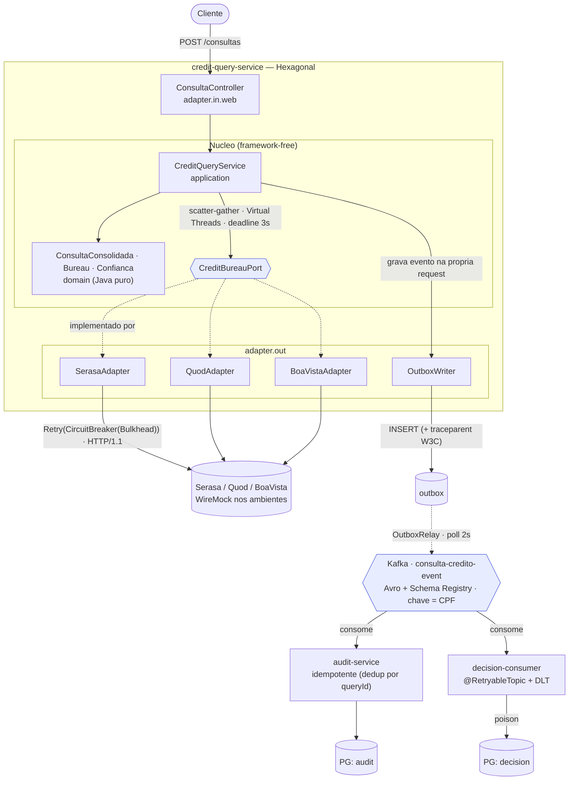
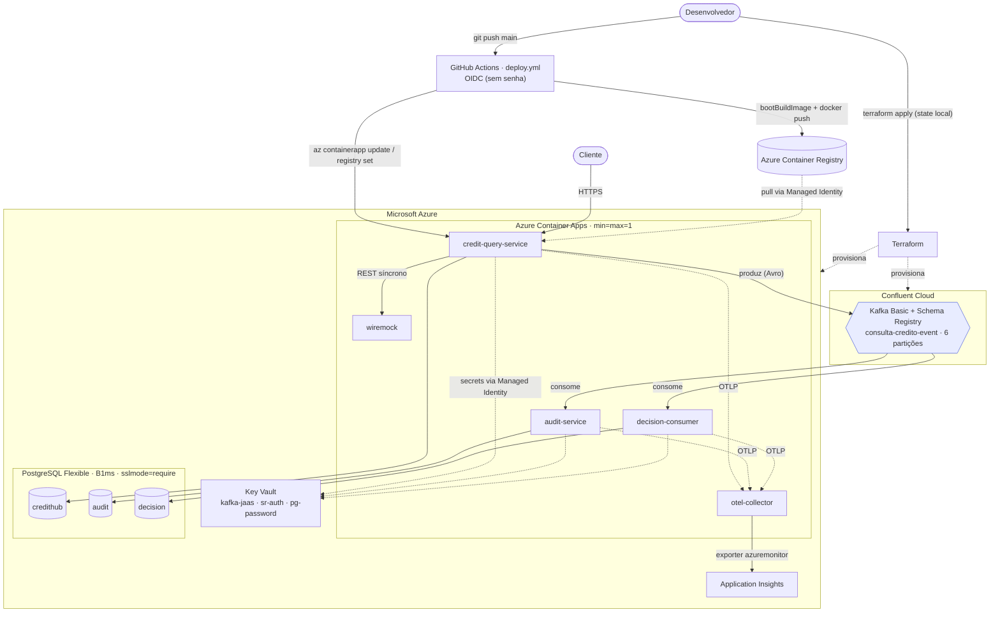

# Credit Hub

Hub interno de consulta a bureaus de crédito (Serasa, Quod, Boa Vista).

## Arquitetura
Projeto utiliza Spring Boot 3.5.16 e Java 21, baseando-se em arquitetura hexagonal (Portas e Adaptadores). A lógica de domínio independe de frameworks.
Para garantir resiliência e concorrência, o aplicativo implementa o padrão scatter-gather, executando chamadas a múltiplos bureaus através de Virtual Threads, com um deadline global.
Para resolver problemas de dupla escrita, o sistema adota o padrão Transactional Outbox, que garante que os eventos sejam publicados atomicamente via banco de dados para os brokers de mensageria (Kafka).

## Módulos
- **credit-hub-domain**: Regras de negócio puras (sem dependências externas).
- **credit-hub-application**: Casos de uso e portas de entrada/saída.
- **credit-hub-adapter**: Implementação técnica (Web, JPA, Kafka, Resilience4j).
- **credit-hub-bootstrap**: Configuração, entry point e wiring dos módulos.
- **credit-hub-events**: Contratos e esquemas Avro compartilhados.
- **audit-service**: Serviço consumidor idempotente, responsável por manter a trilha de auditoria.
- **decision-consumer**: Consumidor de regras de negócio com resiliência baseada em @RetryableTopic (non-blocking retries) e envio para Dead Letter Topic (DLT) persistida em banco de dados.

## Diagramas de Arquitetura

### 1. Arquitetura da Aplicação (Spring / Hexagonal)

O `credit-query-service` segue arquitetura hexagonal, com a dependência **sempre apontando para dentro** (`bootstrap → adapter → application → domain`). O hot path é **síncrono** (responde ao cliente sob um deadline global, sem depender do Kafka); a integração com os consumidores é **assíncrona** via Transactional Outbox.



### 2. Infraestrutura Cloud e CI/CD (Azure + Confluent)

O sistema roda em **Azure Container Apps** com **Confluent Cloud** para Kafka/Schema Registry. O Terraform é dono da infraestrutura (state local); o GitHub Actions é dono da imagem (build + push no ACR + `az containerapp update`), autenticando via **OIDC** e resolvendo segredos por **Managed Identity** no Key Vault.



## Tecnologias e Infraestrutura
- Java 21 + Virtual Threads + Spring Boot
- Resilience4j (Bulkhead, Circuit Breaker, Retry)
- PostgreSQL (Azure Flexible Server)
- Apache Kafka + Confluent Schema Registry (Avro) gerenciados na Confluent Cloud
- Observabilidade: OpenTelemetry Collector, Azure App Insights, Prometheus e Jaeger
- Testes de Carga: Grafana k6
- Infraestrutura como Código: **Terraform**

## Integração Cloud e CI/CD

A infraestrutura foi automatizada e separada da entrega do código da seguinte forma:

1. **Deploy da Infra (Terraform)**:
   O Terraform no diretório `infra/terraform` é responsável por provisionar o Azure (Resource Group, Key Vault, Postgres, Container Apps) e a Confluent Cloud.
   - **Gerenciamento de Estado**: Atualmente o estado do Terraform (`terraform.tfstate`) é mantido localmente. Por isso, **NÃO execute o Terraform Apply pelo GitHub Actions** sem antes migrar o backend para o Azure Storage. O apply deve ser feito da máquina de desenvolvimento.
   - **Imagem Placeholder**: No primeiro provisionamento, o Terraform sobe os Container Apps das aplicações com uma imagem pública "fantasma" (`mcr.microsoft.com/k8se/quickstart:latest`). Isso evita a dependência cíclica (o Container App falhar por não ter a imagem do Azure Container Registry ainda vazio).

2. **Deploy das Aplicações (GitHub Actions)**:
   A pipeline (`.github/workflows/deploy.yml`) assume o controle a partir daí. Ela constrói as imagens (via `bootBuildImage` do Gradle), manda para o ACR criado pelo Terraform e usa o `az containerapp update` para substituir a imagem placeholder pelas imagens finais em Java.

3. **Autenticação OIDC (Sem Senhas)**:
   O GitHub Actions se comunica com o Azure através do Microsoft Entra ID usando **OIDC (OpenID Connect)**. Nenhuma senha de *Service Principal* é estocada no GitHub. Os Container Apps puxam segredos diretamente do Azure Key Vault internamente usando identidades gerenciadas.

## Guia de Deploy na Nuvem (Azure & Confluent)

Para colocar essa arquitetura no ar do zero, siga os passos abaixo.

### Passo 1: Autenticação OIDC no Azure (Terminal)
O GitHub precisa de permissão no seu Azure. Execute os comandos abaixo (em PowerShell ou Bash) para criar o app no Entra ID e vincular ao seu repositório:

```bash
# 1. Cria a Identidade no Entra ID
APP_ID=$(az ad app create --display-name "github-actions-credithub" --query appId -o tsv)
SP_ID=$(az ad sp create --id $APP_ID --query id -o tsv)

# 2. Dá permissão de Contribuidor na Assinatura (para o Terraform provisionar recursos)
SUB_ID=$(az account show --query id -o tsv)
az role assignment create --role contributor --subscription $SUB_ID --assignee-object-id $SP_ID --assignee-principal-type ServicePrincipal --scope "/subscriptions/$SUB_ID"

# 3. Cria a credencial federada (OIDC) - Altere os dados do repositório!
az ad app federated-credential create --id $APP_ID --parameters '{
  "name": "credithub-github-actions",
  "issuer": "https://token.actions.githubusercontent.com",
  "subject": "repo:<SEU_USER>/<SEU_REPO>:ref:refs/heads/main",
  "description": "Permite deploy via GitHub Actions",
  "audiences": ["api://AzureADTokenExchange"]
}'

# 4. Pegue os IDs para cadastrar no GitHub:
echo "Client ID: $APP_ID"
az account show --query '{TenantID:tenantId, SubscriptionID:id}' -o json
```
> **Nota para PowerShell:** O comando de credencial federada (`az ad app federated-credential create`) pode falhar devido às aspas duplas do JSON. Salve o JSON em um arquivo `params.json` e passe como `--parameters @params.json`.

### Passo 2: Segredos e Variáveis do GitHub (Actions)
Vá na aba *Settings > Secrets and variables > Actions* do seu repositório e crie os seguintes **Repository Secrets**:

| Secret | Descrição / Onde Obter |
|---|---|
| `AZURE_CLIENT_ID` | O Client ID (App ID) gerado no Passo 1. |
| `AZURE_TENANT_ID` | O Tenant ID da sua conta Azure (Passo 1). |
| `AZURE_SUBSCRIPTION_ID` | O Subscription ID da sua conta Azure (Passo 1). |
| `AZURE_RG_NAME` | Nome do Resource Group a ser criado pelo Terraform (ex: `credithub-rg`). O CD descobre o ACR dentro dele automaticamente. |
| `PG_PASSWORD` | Senha forte de administrador para o Postgres Flexible Server. |
| `CONFLUENT_CLOUD_API_KEY` | Key do tipo "Cloud API Key" criada no painel web da Confluent Cloud. |
| `CONFLUENT_CLOUD_API_SECRET` | Secret emparelhado com a API Key da Confluent. |

### Passo 3: Provisionar a Infraestrutura (Terraform Local)
Devido ao estado do Terraform estar configurado como **backend local**, o primeiro provisionamento deve ser feito da sua própria máquina (estando previamente autenticado com `az login`).

```bash
cd infra/terraform

# Exporte as variáveis esperadas pelo Terraform
export TF_VAR_postgres_admin_password="SuaSenhaForteAqui"
export CONFLUENT_CLOUD_API_KEY="SuaChave"
export CONFLUENT_CLOUD_API_SECRET="SeuSecret"

terraform init
terraform plan
terraform apply
```

### Passo 4: Deploy das Aplicações (GitHub Actions)
Após o Terraform finalizar, sua infraestrutura estará criada, mas os Container Apps estarão rodando uma imagem placeholder da Microsoft. 
Para injetar o seu código:
1. Volte ao repositório do GitHub.
2. Na aba **Actions**, o fluxo de *CI/CD (Build and Deploy to ACA)* provavelmente rodará sozinho a cada push na `main`, ou você pode disparar o workflow "Build and Deploy to ACA" manualmente.
3. Este fluxo irá utilizar o pacote de build OCI do Spring Boot, empurrará as imagens para o `ACR` recém criado, e forçará o recarregamento dos pods dos Container Apps.

## Como executar
1. Suba a infraestrutura necessária (Postgres, Kafka, Schema Registry, WireMock):
   ```bash
   docker compose up -d
   ```
2. Compile os schemas Avro e construa o projeto:
   ```bash
   ./gradlew build
   ```
3. Execute o módulo principal de consultas:
   ```bash
   ./gradlew :credit-hub-bootstrap:bootRun
   ```
4. Em outra aba de terminal, execute o `audit-service`:
   ```bash
   ./gradlew :audit-service:bootRun
   ```
5. Em outra aba de terminal, execute o `decision-consumer`:
   ```bash
   ./gradlew :decision-consumer:bootRun
   ```

## Roadmap

- [x] Sprint 1-3: Espinha síncrona com Virtual Threads, Scatter-Gather e resiliência com Resilience4j
- [x] Sprint 4: Adicionado Transactional Outbox ao credit-query-service e serviço idempotente audit-service consumindo Kafka + Schema Registry.
- [x] Sprint 5: Criado decision-consumer com @RetryableTopic (retries não-bloqueantes com backoff) + persistência de Dead Letter Topic (DLT) no banco.
- [x] Sprint 6: Observabilidade (Tracing OTLP, Jaeger SPM e Prometheus) e automação de Testes de Carga (k6).
